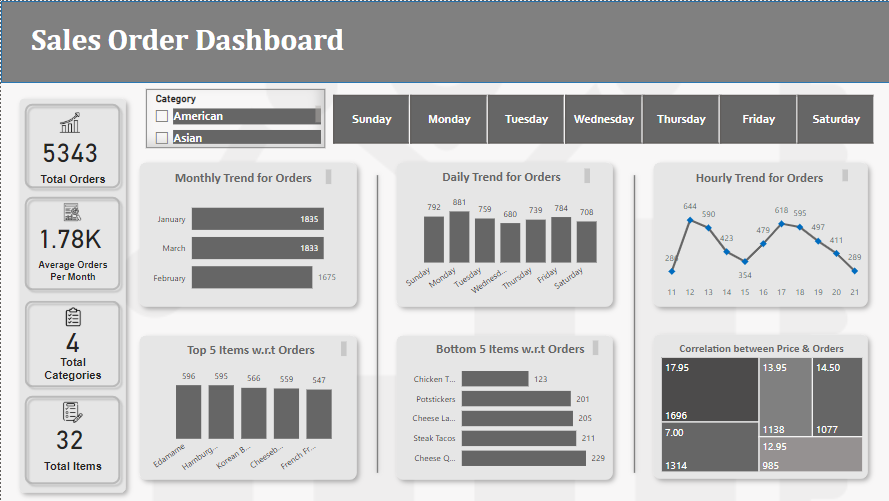
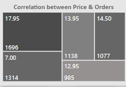
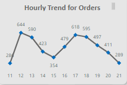
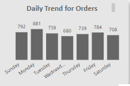
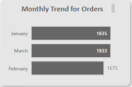
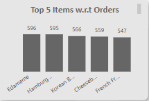
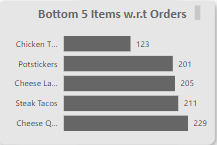

# Sales Order EDA & Power BI Project

## Project Overview

This project highlights a comprehensive data analysis of a **Sales Order Dataset** using Python, MySQL and Power BI. The analysis aims to extract valuable insights from the sales data, providing a better understanding of sales patterns, trends, and performance metrics. The project includes exploratory data analysis (EDA), visualization using Power BI, and an interactive dashboard.

### Key Features:
1. **Exploratory Data Analysis (EDA)** using `pymysql` and Python.
2. **Data Visualization** with Power BI, featuring a range of insightful charts and graphs.
3. **Interactive Dashboard** in Power BI, with a short video displaying its functionality.
4. **Presentation** (PowerPoint) outlining the analysis process, findings, and recommendations.
5. **Jupyter Notebook** containing the SQL queries and code for data processing and visualization.

---

## Files Included

1. ** restaurant_orders_visuals-1.ipynb**  
   - [Download the Sales Order EDA file](restaurant_orders_visuals-1.ipynb)This Jupyter notebook contains the Python code used for the entire data analysis process. It includes SQL queries written using the `pymysql` library to interact with the dataset stored in a MySQL database.
   - The notebook performs various steps of EDA, including data cleaning, transformation, and visualization.

2. **sales_order.pbix**  
   -  [Download the Sales Order Dashboard](sales_order.pbix) Power BI file highlighting the detailed data visualization and interactive dashboard.
   - This includes several charts and graphs, such as sales trends and product performance   - The file is configured for easy interaction and exploration of sales order data.

3. **Sales_Order_Analysis.pptx**
   - [Sales Order Analysis Report](https://github.com/SanaMubarak01/Sales_Order_Analysis_EDA_PowerBI/blob/master/Sales%20Order%20Analysis.pptx) A PowerPoint presentation summarizing the analysis process, key insights, charts, and actionable recommendations based on the data analysis.
   - It includes a comprehensive breakdown of the visuals and explanations of trends and patterns observed in the data.

5. **Dashboard_Interactive.gif**  
   - A short animated GIF that demonstrates the interactive dashboard features in Power BI.
   - The video displays how users can interact with filters, slicers, and visual elements to gain deeper insights into the sales data.

---

## Project Details

### 1. **Data Extraction and EDA**
The project begins with extracting the sales order data from a MySQL database using the `pymysql` library in Python. The following EDA steps were performed:

- **Data Cleaning**: Handling missing values, correcting data types, and removing duplicates.
- **Data Transformation**: Aggregating data by products, and time periods to derive meaningful metrics.
- **Statistical Analysis**: Performing basic statistics such as mean and correlation analysis to understand key factors influencing sales.

  

### 2. **Data Visualization in Power BI**
Using Power BI, the following visualizations are created to present the insights effectively:

- **Sales Performance over Time**: Line charts to show case trends and patterns in sales orders over different periods (hours).

   
-**Daily Order trends**: Column chart to visualize frequency of orders over different days of the week.

  
- **Product Sales Analysis**: Bar and column charts to visualize product wise orders distribution.

 

  
### 3. **Interactive Dashboard**
The Power BI interactive dashboard allows users to filter and slice data dynamically. Key features include:

- **Filter by Days Range**: Users can select specific periods to view trends and performance.
- **Product Category Filters**: Allows segmentation of data by product categories.
- **Responsive Visuals**: Each element on the dashboard updates dynamically based on the selections made by the user.

### 4. **Key Insights and Recommendations**
The PowerPoint presentation includes a detailed summary of the findings from the analysis:

- **High-performing products**: Insights into top-selling and bottom-selling products and their contribution to overall sales orders.
- **Sales orders seasonality**: Identification of peak sales months.
- **Recommendations**: Actionable insights such as targeted marketing strategies to maximize revenue.

---

## Requirements

### Software & Libraries:
1. **Python** (for performing EDA and SQL queries):
   - `pymysql` for MySQL database connection.
   - `pandas`, `matplotlib`, `seaborn` for data processing and visualization.
   - `jupyter` for running the notebook.
   
2. **Power BI** (for data visualization and dashboard):
   - Power BI Desktop (for viewing and interacting with the dashboard).
   
3. **MySQL Database** (for sales data storage):
   - Ensure that your database is set up with the required tables and data.

### Setup Instructions:
1.	Install Python libraries by running:
pip install pymysql pandas matplotlib seaborn jupyter
2. Ensure that you have access to the sales data in MySQL.
3. Open the **restaurant_orders_visuals-1.ipynb** notebook to execute the SQL queries and perform the analysis.
4. Open the **sales_order.pbix** file in Power BI to explore the visualizations and dashboard.

---

## How to Use

1. **EDA and SQL Queries**:
- Open and run the Jupyter notebook to view the SQL queries and EDA steps.

2. **Power BI Dashboards**:
- Open the Power BI file and interact with the dashboard.
- You can filter by days and product categories to explore different aspects of the sales order data.

3. **Presentation**:
- Review the PowerPoint presentation for a high-level summary of the analysis, insights, and recommendations.

4. **Interactive Demo**:
- Watch the **sales_order_EDA_dashboard.gif** file to see a quick demo of the Power BI dashboard in action.

---

## Conclusion

This project demonstrates the process of performing detailed data analysis on sales orders, using a combination of Python, MySQL, and Power BI. By leveraging SQL queries to extract and manipulate data, followed by insightful visualizations and an interactive dashboard, the project provides actionable recommendations for improving sales performance and strategic decision-making.

 
Feel free to explore the files and interact with the dashboard to gain deeper insights into the sales data!
